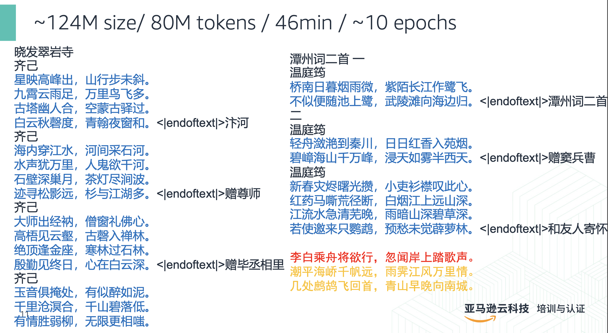

# TinyLM
Train a TinyLM from scratch, [slides](assets/What%20I%20learned%20from%20pretraining%20a%20tiny%20toy%20LLM.pdf)

# Task and Scenario
Train a tiny LLM to write poem in Chinese

# Data preprocessing
56315 Chinese Tang poem

# Models trained
## nanoGPT
Modified from https://github.com/karpathy/nanoGPT

size: 0.1-0.7B

Train loop: use naive train loop in nanoGPT

## MyMistral
Modified from Mistral-7B

size: 0.4-0.9B

Train loop: use HuggingFace tranformers trainer

# Result

# Roadmap
- [x] Pretrain
- [x] Single node
- [ ] SFT
- [ ] Alignment
- [ ] Multi-node multi-gpu / FSDP
- [ ] Small model 1-7B
- [ ] MoE
- [ ] Multimodal
- [ ] Fine-tune

Winston Zhang

2024/03/08